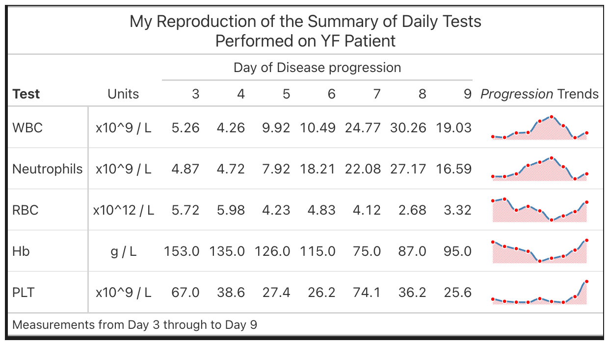

# Welcome to the Great Tables Repository

This repository serves as an illustrative guide to showcase the usage of the `Great Tables` package in my everyday data science projects. I have been utilizing `gt` (along with `gtExtras`) for tabular data manipulation since May 2018, but recently I am transitioning to `Python` for my data science projects. In the process, I will be using the `Great Tables` library instead of `gt` for all my personal and professional tabulation requirements.

The `Great Tables` library offers a comprehensive set of tools to create and manipulate publication-quality tables with a high degree of customization. It provides a wide range of formatting options, including customizable font styles, table borders, and column/row headers. Moreover, it offers advanced table features such as grouping, merging, and nesting tables.

I have found the `Great Tables` library to be a comprehensive and flexible tool for generating tables with ease and efficiency. With its vast range of formatting options and advanced table features, it has significantly improved my workflow, saving me a lot of time and effort.

Overall, this repository provides a glimpse into how I utilize `Great Tables` in my day-to-day projects, and I hope it helps others in their data science endeavors.